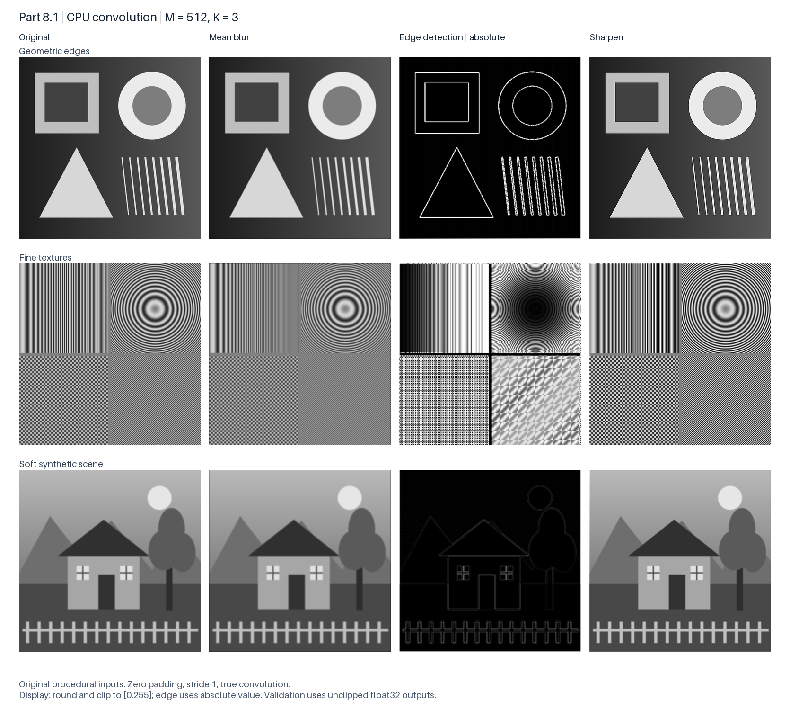

# Part 8.1 CPU Convolution

**Scope:** Member A, Part 8.1. **Measurement date:** October 6, 2026, PDT.

The CPU convolution was checked with three original procedural grayscale images. All 33 tested configurations passed the numerical checks. The images and filter results below are ready for the Part 8.1 report; the timings are local Mac measurements. CPU and CUDA must be measured again on the same experimental machine before calculating speedups.

本部分使用三张程序生成的原创灰度图验证 CPU 卷积，33 个配置全部通过数值检查。下方图像可用于 Part 8.1 报告；耗时来自 Mac 本地测量。计算 CPU/CUDA 加速比前，需在统一实验机重新采集两者的耗时。

## Images and filters

The inputs contain geometric edges, fine textures, and a soft synthetic scene. Each 2048×2048 original was converted to 512×512, 1024×1024, and 2048×2048 unsigned 32-bit pixel arrays with values from 0 to 255. The CPU implementation performs true convolution with stride 1, zero padding, float32 filter weights and accumulation, and an output of the same size as the input.

三类输入分别用于观察清晰轮廓、细密纹理和柔化场景。原图均为 2048×2048，转换成三种尺寸的 uint32 像素数组，取值范围为 0–255。实现采用真正的数学卷积、步长 1、零填充，滤波器、累加和输出使用 float32，输出尺寸保持不变。

| Filter | Weights for a K×K kernel | Purpose |
|---|---|---|
| Mean | All entries are 1/K² | Smooth local intensity variation / 平滑局部变化 |
| Edge | Center is K²−1; all other entries are −1 | Highlight intensity transitions / 提取亮度边缘 |
| Sharpen | Twice the identity kernel minus the mean kernel | Increase local contrast / 增强局部对比 |

**Figure 1.** Results at M=512 and K=3. Mean filtering attenuates the fine texture; edge detection responds to shape boundaries; sharpening increases local contrast. PNG values are rounded and clipped to [0,255]. The edge column displays the absolute value of the signed output. Numerical validation uses the original float32 values before this display mapping. Responses along the outer image border are expected with zero padding.

**图 1。** M=512、K=3 时的原图与滤波结果。均值滤波减弱细密纹理，边缘检测突出轮廓，锐化增强局部对比。PNG 仅用于显示：取整并裁剪到 [0,255]，边缘图额外取绝对值。数值验证使用处理前的原始 float32 输出；图像外围的响应来自零填充。

## Correctness

For each image, mean filtering was tested at all nine combinations of M=512/1024/2048 and K=3/5/7. Edge and sharpening filters were also checked at M=512, K=3, giving 33 configurations. Each configuration had one warm-up and three measured calls. All 99 measured calls passed the double-precision C reference comparison using `abs(error) <= 1e-3 + 1e-4 * abs(reference)`; the largest recorded absolute error was approximately 1.73343×10⁻⁴. Nine saved filter outputs also passed an independent NumPy float64 implementation, with maximum absolute error 6.50138×10⁻⁵. The self-test additionally checks an asymmetric kernel to distinguish convolution from cross-correlation.

每张图覆盖三种图像尺寸与三种滤波器尺寸的全部九种均值滤波组合，另测边缘检测和锐化，共 33 个配置。每组预热一次、测量三次，99 次测量全部通过 C 双精度参考检查，最大绝对误差约为 1.73343×10⁻⁴。九份展示输出同时通过独立 NumPy 双精度实现的逐像素检查，最大绝对误差为 6.50138×10⁻⁵。自检另有非对称滤波器用例，用于区分卷积与互相关。具体尺寸、误差阈值及重复次数沿用组内约定；PDF 要求至少三种图像尺寸、三种滤波器尺寸及包含边缘检测的图像展示。

## Local CPU measurements

The following values are compute time in milliseconds, reported as mean ± sample standard deviation over three calls. The environment was macOS 27.0.1 on arm64, compiled with Apple Clang 21.0.0 and `-O2`. Image loading, reference calculations, validation, and figure export are outside the measured region. The current CPU implementation reports identical compute and end-to-end times because both cover the convolution loop. Hardware model and memory queries were unavailable in the execution sandbox.

下表为三次运行的计算耗时均值 ± 样本标准差，单位毫秒。环境为 macOS 27.0.1、arm64，使用 Apple Clang 21.0.0 和 `-O2` 编译。计时不含图片读取、参考结果计算、正确性验证和图片导出；当前 CPU 的 compute 与 end_to_end 都覆盖卷积循环，因此数值相同。执行环境未能读取具体 CPU 型号和内存。

| Image | M | K=3 | K=5 | K=7 |
|---|---:|---:|---:|---:|
| geometry | 512 | 2.345 ± 0.081 | 4.431 ± 0.225 | 9.677 ± 0.093 |
| geometry | 1024 | 9.255 ± 0.086 | 17.819 ± 0.466 | 39.308 ± 0.659 |
| geometry | 2048 | 36.221 ± 0.088 | 74.726 ± 8.288 | 155.399 ± 1.909 |
| frequency | 512 | 2.293 ± 0.020 | 4.218 ± 0.046 | 9.841 ± 0.249 |
| frequency | 1024 | 8.778 ± 0.623 | 16.990 ± 0.114 | 38.713 ± 0.213 |
| frequency | 2048 | 36.239 ± 0.285 | 67.724 ± 0.772 | 155.914 ± 1.991 |
| soft_scene | 512 | 2.305 ± 0.068 | 4.285 ± 0.016 | 9.698 ± 0.405 |
| soft_scene | 1024 | 9.472 ± 0.197 | 17.272 ± 0.159 | 48.429 ± 9.115 |
| soft_scene | 2048 | 36.829 ± 0.233 | 68.481 ± 1.503 | 159.247 ± 2.406 |

**Table 1.** Mean-filter CPU compute times on three images. All recorded samples, including slower runs, are retained.

For fixed K, doubling the image side generally increases time by about four times, consistent with processing four times as many pixels. Larger kernels require more work per pixel. Some samples varied substantially: soft_scene at M=1024, K=7 ranged from 38.705 to 56.778 ms. These local results establish CPU behavior and correctness; they do not establish a GPU speedup.

**表 1。** 三张图的均值滤波 CPU 计算耗时，保留全部样本，包括较慢运行。固定 K 时，图像边长翻倍后像素数增加为四倍，耗时总体也接近四倍；较大的滤波器增加每个像素的计算量。部分运行存在明显波动，例如 soft_scene 在 M=1024、K=7 时为 38.705–56.778 ms。本地结果用于说明 CPU 行为和正确性，尚不能得出 GPU 加速比。
