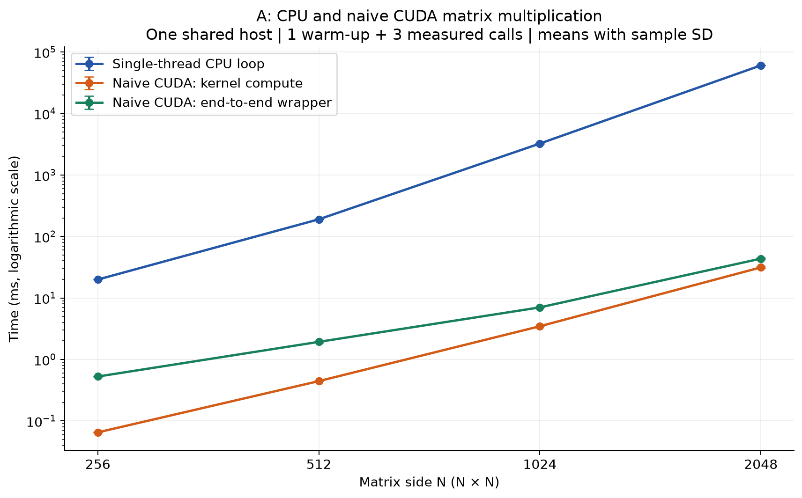
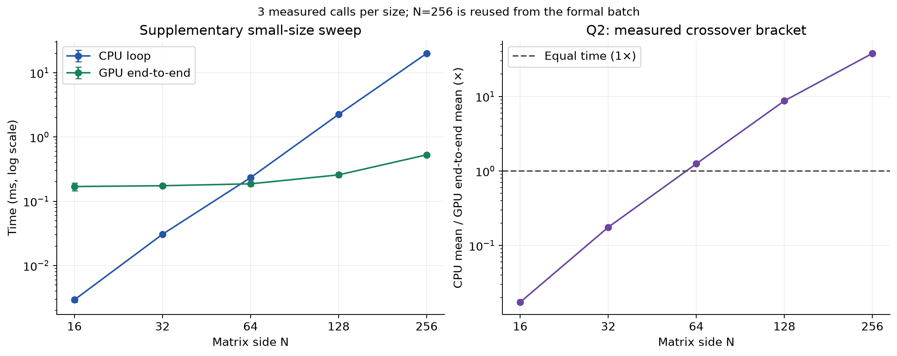
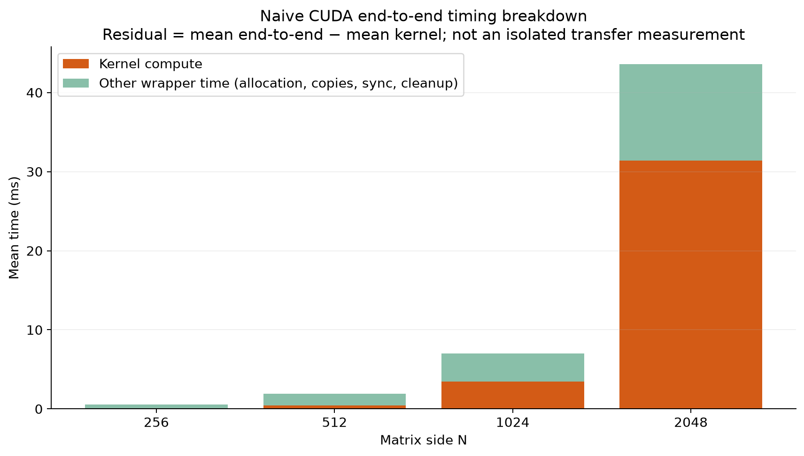
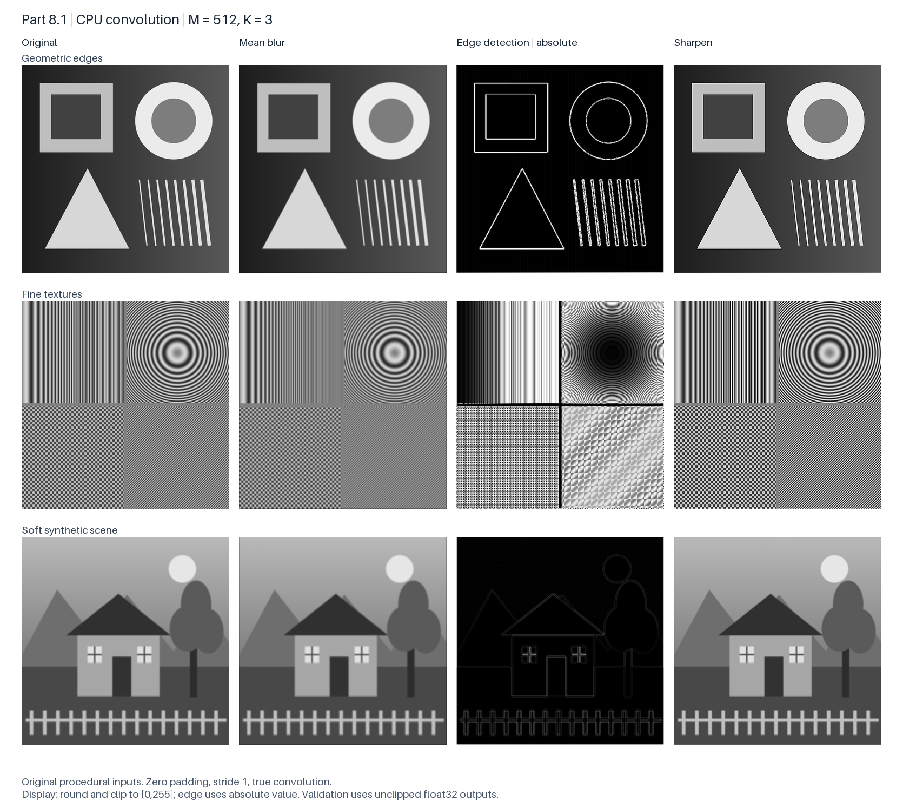

# Member A — Parts 1–3 and 8.1

**Measurement date:** October 6, 2026, PDT. **Platform:** AWS us-west-2, g4dn.2xlarge, NVIDIA Tesla T4.

## Parts 1–2: CPU and naive CUDA matrix multiplication

The CPU baseline uses a single-threaded i–j–k loop. The naive CUDA kernel assigns one output element to each thread, using 16×16 thread blocks and bounds checks. Both compute C=A×B with row-major float32 matrices generated from seed 542. The host is an 8-vCPU Intel Xeon Platinum 8259CL instance with 32 GiB RAM and a T4 reporting 15,360 MiB VRAM. Measurements use Ubuntu 22.04.5, GCC 11.4.0 with `-O2`, and CUDA Toolkit 12.8.93 with `-O2 -arch=sm_75`; the driver is 595.91.07.

CPU 基线使用单线程 i–j–k 三重循环；naive CUDA 每个线程计算一个输出元素，采用 16×16 线程块并检查边界。两者使用 seed=542 生成的行主序 float32 矩阵，计算 C=A×B。测试在同一台 8 vCPU、32 GiB 内存的 Xeon Platinum 8259CL / T4 云主机上串行完成，CPU 没有使用多线程或优化 BLAS。

Each configuration has one warm-up and three measured calls. Table 1 reports arithmetic mean ± sample standard deviation, retaining every sample. CPU time covers the multiplication loop; CUDA compute time uses events around the kernel. CUDA end-to-end time covers device allocation, host-to-device copies, kernel execution, synchronization, device-to-host copy and cleanup. Input generation, the double-precision reference, correctness checks and file I/O are excluded. These are warmed calls, not process startup or first CUDA-context initialization.

每组预热一次、计时三次，下表报告均值 ± 样本标准差，保留全部样本。CPU 计时覆盖乘法循环，CUDA compute 使用事件测量内核；CUDA end_to_end 另含显存分配、双向拷贝、同步与释放。输入生成、双精度参考计算、验证和文件读写不计时；预热后的结果不代表进程启动或首次 CUDA 上下文初始化的开销。

| N | CPU loop (ms) | CUDA compute (ms) | CUDA end-to-end (ms) | CPU / CUDA end-to-end |
|---:|---:|---:|---:|---:|
| 256 | 19.931 ± 0.016 | 0.065 ± 0.000 | 0.527 ± 0.005 | 37.80× |
| 512 | 190.189 ± 0.468 | 0.444 ± 0.002 | 1.932 ± 0.045 | 98.44× |
| 1024 | 3,244.281 ± 1.925 | 3.466 ± 0.003 | 7.025 ± 0.052 | 461.82× |
| 2048 | 60,545.615 ± 533.899 | 31.391 ± 0.901 | 43.610 ± 0.889 | 1388.36× |

**Table 1.** Same-host CPU and naive CUDA matrix results. Speedup is the ratio of mean CPU time to mean CUDA end-to-end time. N=512/1024/2048 follow the assignment; N=256 is the team's additional baseline.

**表 1。** 同机 CPU 与 naive CUDA 结果，加速比为两种平均耗时之比。512/1024/2048 来自实验文档，256 是组内补充尺寸。

**Figure 1.** Runtime increases with matrix size; the vertical axis is logarithmic. The arithmetic work grows as N³, but measured CPU time does not follow an exact eightfold increase when N doubles. The baseline reads B with a stride in its inner loop; memory-system effects are a plausible contributor, but were not isolated with a profiler. GPU compute time grows from 0.065 ms at N=256 to 31.391 ms at N=2048. The end-to-end speedup increases from 37.80× to 1388.36× against this specific single-thread baseline.

**图 1。** 耗时随矩阵规模增大，纵轴为对数刻度。计算量为 O(N³)，但 CPU 实测并非边长翻倍后严格耗时八倍；内层循环跨行访问 B，访存行为可能影响增长，但本实验未用性能分析器隔离具体原因。GPU 内核耗时从 0.065 ms 增至 31.391 ms；相对本次单线程 CPU 基线的整体加速比从 37.80× 增至 1388.36×。

All 24 formal measured calls and 24 supplementary small-size calls passed `abs(error) <= 1e-3 + 1e-4 * abs(reference)`, with nonfinite outputs rejected. The largest formal absolute error was 0.00160635; correctness uses the combined absolute and relative tolerance. CPU and naive CUDA self-tests also passed, including non-block-aligned matrices. Supplementary N=16/32/64/128 measurements support the Q2 discussion in the video.

正式尺寸与补充小尺寸各有 24 次计时调用，全部通过上述绝对误差与相对误差组合检查，并拒绝非有限输出。正式矩阵最大绝对误差为 0.00160635；不能只拿它与绝对阈值 0.001 比较。CPU 和 naive CUDA 自检也通过，包括非线程块整数倍的矩阵。补充小尺寸用于视频中的 Q2 分析。

### Analysis questions Q1 and Q2

**Q1. How does performance change as matrix size increases?** All three timings grow with N, but at different rates. Each doubling of N multiplies the arithmetic work by eight. The CPU loop grew by 9.5×, 17.1× and 18.7× across the three formal doublings, faster than the arithmetic alone. This is consistent with the strided reads of B leaving the caches at larger N, although no profiler isolated the cause. The naive kernel grew by 6.8×, 7.8× and 9.1×, approaching the cubic rate once the GPU is fully occupied. GPU end-to-end time grew more slowly, by 3.7×, 3.6× and 6.2×. At small N it is dominated by work outside the kernel, whose share of end-to-end time falls from 87.6% at N=256 to 28.0% at N=2048 (Figure 3). As a result, the end-to-end speedup over this single-thread CPU baseline rises from 37.80× to 1388.36×.

**Q1. 性能如何随矩阵规模变化？** 三种耗时都随 N 增大，但增速不同。N 每翻倍，运算量增加 8 倍。CPU 循环在三次正式翻倍中分别增加 9.5×、17.1×、18.7×，快于运算量本身；这与较大 N 下跨行读取 B 超出缓存的情况相符，但未用性能分析器单独验证。naive 内核分别增加 6.8×、7.8×、9.1×，在 GPU 被充分占用后接近立方增长。GPU 整体耗时增长更慢，分别为 3.7×、3.6×、6.2×：小尺寸时整体耗时主要是内核以外的开销，其占比从 N=256 的 87.6% 降到 N=2048 的 28.0%（图 3）。因此相对单线程 CPU 基线的整体加速比从 37.80× 升至 1388.36×。

**Q2. At what point does the GPU significantly outperform the CPU?** The answer depends on the timing scope (Figure 2). Counting only the kernel, the GPU is slower at N=16 (0.35×) and already faster at N=32 (3.28×). Including allocation, copies, synchronization and cleanup, the GPU needs roughly 0.17–0.19 ms even for N=16–64, so the CPU stays faster at N=32 (0.18×). The measured end-to-end crossover lies between N=32 and N=64, where the GPU is only 1.25× faster. A clear advantage appears by N=128 (8.73×) and grows to 37.80× at N=256. This bracket applies to this T4 host, this naive kernel and warmed calls; three samples per size do not establish an exact threshold.

**Q2. GPU 从什么规模起明显快于 CPU？** 答案取决于计时范围（图 2）。只看内核，N=16 时 GPU 更慢（0.35×），N=32 时已更快（3.28×）。计入分配、拷贝、同步和释放后，N=16–64 的 GPU 整体耗时都在约 0.17–0.19 ms，因此 N=32 时仍是 CPU 更快（0.18×）。整体耗时的实测交叉点在 N=32 与 64 之间，N=64 时 GPU 仅快 1.25×；到 N=128 已有明确优势（8.73×），N=256 时为 37.80×。该区间只针对本次 T4 主机、naive 内核和预热后的调用；每个尺寸三次测量不足以确定精确阈值。

**Figure 2.** Left: CPU loop and GPU end-to-end time for N=16–256. Right: ratio of mean CPU time to mean GPU end-to-end time; the dashed line marks equal time. N=16/32/64/128 are supplementary sizes added for Q2; N=256 reuses the formal batch.

**图 2。** 左：N=16–256 的 CPU 循环与 GPU 整体耗时。右：CPU 均值与 GPU 整体耗时均值之比，虚线表示两者相等。N=16/32/64/128 是为 Q2 补充的尺寸，N=256 复用正式批次。

**Figure 3.** Mean end-to-end time split into kernel compute and the remainder (allocation, copies, synchronization and cleanup). The remainder is end-to-end minus kernel time, not a separately measured transfer time.

**图 3。** 整体耗时拆分为内核计算与其余部分（分配、拷贝、同步、释放）。其余部分为整体耗时减去内核耗时，不是单独测得的传输时间。

## Part 3: Cloud GPU execution

The CUDA environment was also verified inside the official `nvidia/cuda:12.8.1-devel-ubuntu22.04` GPU container. A fresh in-container build, naive CUDA self-tests, and nine measured calls across N=256/512/1024 all passed. The container had no network access during this verification and was removed after exit. Table 1 contains the separate host measurements, so container checks are not mixed into the comparison.

另外在 NVIDIA 官方 CUDA 12.8.1 GPU 容器内重新编译并执行 naive 自检，以及 N=256/512/1024 的九次计时调用，全部通过。验证期间容器不联网，退出后自动移除。表 1 采用独立的宿主机正式批次，没有混合容器数据。

## Part 8.1: CPU convolution

### Images and filters

The three original procedural grayscale images contain geometric edges, fine textures and a soft synthetic scene. Each 2048×2048 original was converted to M=512/1024/2048 unsigned 32-bit pixel arrays in [0,255]. The CPU implementation performs true convolution with stride 1, zero padding and same-size float32 output. Filter weights and accumulation are float32.

三张原创程序生成的灰度图分别包含几何轮廓、细密纹理和柔化场景。2048×2048 原图被转换成三种尺寸的 uint32 像素数组，像素值为 0–255。C 程序在 CPU 上执行真正的数学卷积，采用步长 1、零填充和同尺寸输出；滤波器、累加与输出均为 float32。

| Filter | K×K weights | Purpose |
|---|---|---|
| Mean | Every entry is 1/K² | Smooth local intensity variation / 平滑局部变化 |
| Edge | Center K²−1; all others −1 | Highlight intensity transitions / 提取亮度边缘 |
| Sharpen | 2 × identity kernel − mean kernel | Increase local contrast / 增强局部对比 |

**Figure 4.** CPU results at M=512, K=3. Mean filtering attenuates fine texture, edge detection responds to boundaries, and sharpening increases local contrast. PNG display rounds and clips to [0,255]; the edge column first takes the absolute value. Validation uses the signed, unclipped float32 output. Border responses are expected with zero padding.

**图 4。** M=512、K=3 的 CPU 结果。均值滤波减弱纹理，边缘检测突出轮廓，锐化增强局部对比。显示时取整并裁剪到 [0,255]，边缘图先取绝对值；数值验证仍使用带符号、未裁剪的 float32 输出，外围响应来自零填充。

### Correctness and CPU measurements

Each image was tested with all nine combinations of M=512/1024/2048 and K=3/5/7 using mean filters, plus edge and sharpen at M=512, K=3. All 33 configurations and 99 measured calls passed the double-precision C reference, with maximum absolute error 1.73343×10⁻⁴. Nine saved display-case outputs also passed an independent NumPy float64 convolution, with maximum absolute error 7.56532×10⁻⁵. The self-test includes an asymmetric filter to distinguish convolution from cross-correlation.

每张图测试三种图像尺寸与三种滤波器尺寸的九种均值滤波组合，另测边缘与锐化，共 33 个配置、99 次计时调用，全部通过 C 双精度参考检查，最大绝对误差为 1.73343×10⁻⁴。九份展示用输出同时通过独立 NumPy 双精度卷积校验，最大绝对误差为 7.56532×10⁻⁵；非对称滤波器自检用于区分卷积与互相关。

The following CPU times were collected on the same AWS host as Table 1, using GCC 11.4.0 and `-O2`. Values are mean ± sample standard deviation over three measured calls after one warm-up. Loading images, building the reference, validation and PNG export are excluded. CPU compute and end-to-end fields both cover the convolution loop and therefore have identical values.

下表来自表 1 的同一台 AWS 主机，使用 GCC 11.4.0 和 `-O2`。数值为一次预热后三次计时的均值 ± 样本标准差，单位毫秒。读取图片、参考计算、验证和图片导出不计时；当前 CPU 的两种计时字段都覆盖卷积循环，因而数值相同。

| Image | M | K=3 (ms) | K=5 (ms) | K=7 (ms) |
|---|---:|---:|---:|---:|
| geometry | 512 | 5.317 ± 0.014 | 12.709 ± 0.014 | 23.396 ± 0.020 |
| geometry | 1024 | 21.262 ± 0.026 | 51.038 ± 0.090 | 93.921 ± 0.121 |
| geometry | 2048 | 85.031 ± 0.034 | 204.197 ± 0.113 | 375.848 ± 0.071 |
| frequency | 512 | 5.298 ± 0.005 | 12.729 ± 0.024 | 23.447 ± 0.014 |
| frequency | 1024 | 21.280 ± 0.011 | 51.007 ± 0.019 | 93.816 ± 0.022 |
| frequency | 2048 | 85.081 ± 0.081 | 204.141 ± 0.078 | 375.455 ± 0.074 |
| soft_scene | 512 | 5.307 ± 0.016 | 12.702 ± 0.004 | 23.390 ± 0.005 |
| soft_scene | 1024 | 21.187 ± 0.011 | 50.899 ± 0.018 | 93.807 ± 0.016 |
| soft_scene | 2048 | 85.546 ± 0.979 | 204.112 ± 0.133 | 375.790 ± 0.446 |

**Table 2.** Mean-filter CPU convolution times. For fixed K, doubling M increases time by approximately four times, consistent with four times as many output pixels. Increasing K increases the work per pixel. These results provide the CPU baseline for the later CUDA convolution comparison.

**表 2。** 均值滤波的 CPU 卷积耗时。固定 K 时，M 翻倍后输出像素数为四倍，耗时也约为四倍；增大 K 会增加每个像素的运算量。这些同机 CPU 数据用于后续 CUDA 卷积对比。
